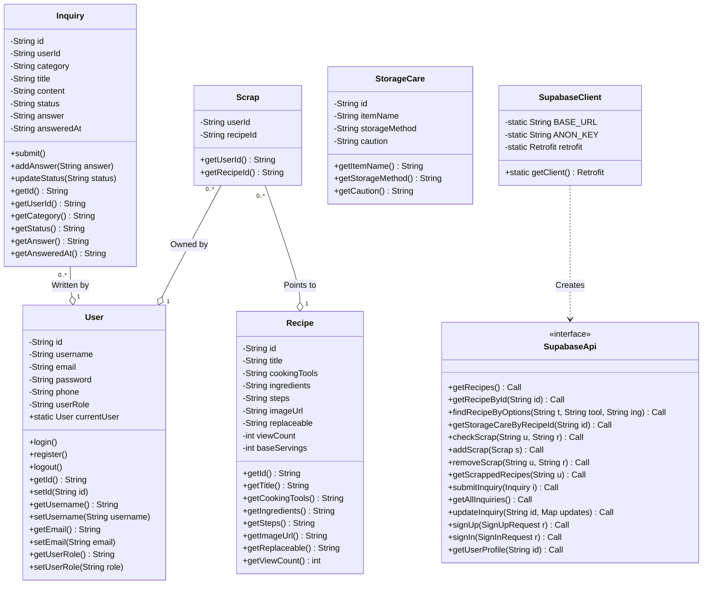
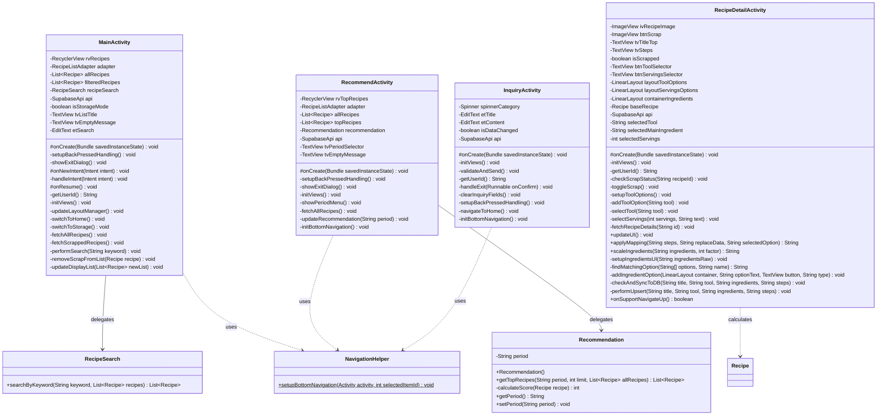
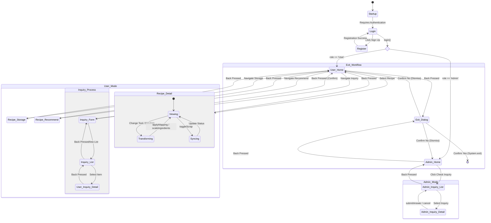

# 3. Design

**자취생 요리 도우미 - 든든(Deun Deun)**

**22212060 김규진 | [EMAIL] Kimmkyujin1208@naver.com**

---

## [ Revision history ]

| Revision date | Version | Description | Author |
|:---|:---:|---|:---:|
| 26.05.11 | 0.1.0 | Design 초안 작성 | kyujin |
| 26.05.14| 0.1.1 |1.Introduction, 2.Class diagram 내용 추가 | kyujin|
| 26.05.22|0.1.2 |클래스 다이어그램 수정 |kyujin |
| 26.05.26|0.2.0 |순차 및 상태 다이어그램 추가, 5, 6, 7번 작성 |kyujin |
| 26.05.26|0.2.1 | 클래스 다이어그램 수정 |kyujin |
| 26.06.03|0.3.0 | 2번, 4번 수정 및 3번 평서문체로 변경, 5번 6번 7번 내용 추가 |kyujin |

---

## Contents

1. Introduction
2. Class diagram
3. Sequence diagram
4. State machine diagram
5. Implementation requirements
6. Glossary
7. References

---

## 1. Introduction

본 문서는 Analysis 단계 문서에 이어지는 든든(Deun Deun) 어플리케이션의 Design 단계 문서이다.

### 1.1 Summary
든든(Deun Deun)은 자취생과 1인 가구를 위한 맞춤형 요리 보조 어플리케이션으로, 사용자의 보유 재료 및 조리도구 상황에 맞게 레시피를 동적으로 변환하여 제공하는 것을 핵심 기능으로 한다. Analysis 단계에서 정의된 10개의 Use Case를 바탕으로, 본 Design 문서에서는 시스템을 구성하는 클래스 구조, 주요 기능 흐름(Sequence Diagram), 상태 전이(State Machine Diagram)를 구체적으로 정의한다.

### 1.2 Important Points of Design

- **레시피 변환 중심 설계:** 사용자의 인원수·재료·조리도구 선택에 따라 레시피를 동적으로 변환하는 것이 든든 앱의 핵심 기능이며, 모든 다이어그램에서 이 흐름을 중심으로 설계한다.

- **권한 기반 접근 제어:** 일반 사용자(USER)와 관리자(ADMIN)의 역할을 명확히 구분하여, 각 기능에 대한 접근 범위를 제한한다.

- **데이터 무결성 유지:** 클래스 간 다대다 관계를 연관 클래스로 분리하고, 원본 데이터를 직접 수정하지 않는 방향으로 설계한다.

- **예외 처리 흐름 명확화:** 네트워크 오류, 빈 입력, 중복 데이터 등 Use Case에서 정의된 예외 시나리오를 각 다이어그램에서 구체적으로 표현한다.

---

## 2. Class diagram

### 2.1 Data & Network Class Diagram

해당 Class Diagram은 데이터 구조와 서버(Supabase)와의 규칙을 정의한 Diagram이다.
시스템의 전체적인 뼈대로 역할에 따른 유저의 분류, 레시피가 무엇과 매핑되는지, 문의사하이 어떠한 사이클로 이루어지는지, 그리고 이에 대한 데이터들이 Supabase 상에 어떻게 연결되는지를 나타낸다.

---

#### 2.1.1 User

| Attributes | Details |
|---|---|
| id: String | 사용자 고유 식별자 (Supabase UUID) |
| username: String | 사용자 아이디 (로그인 및 식별용) |
| email: String | 사용자 이메일 주소 |
| password: String | 사용자 비밀번호 (인증용) |
| phone: String | 사용자 전화번호 |
| userRole: String | 사용자 권한 구분 ('User' / 'Admin') |
| currentUser: static User | 앱 전역에서 공유되는 현재 로그인 사용자 객체 |
| callback: AuthCallback | 로그인/회원가입 결과 처리를 위한 콜백 인터페이스 |
| TAG: static final String | 디버깅 로그 기록을 위한 클래스 식별 태그 |

| Methods | Details |
|---|---|
| setAuthCallback(callback: AuthCallback): void | 인증 결과를 전달받을 콜백 객체를 설정함 |
| login(): void | Supabase Auth와 User 테이블을 연동하여 인증 및 권한 확인을 수행함 |
| register(): void | 입력된 정보를 바탕으로 서버에 계정 및 프로필 데이터를 생성함 |
| logout(): void | currentUser를 null로 설정하여 앱 세션을 종료함 |
| getId() / setId(id: String): void | id 속성의 Getter 및 Setter |
| getUsername() / setUsername(username: String): void | username 속성의 Getter 및 Setter |
| getEmail() / setEmail(email: String): void | email 속성의 Getter 및 Setter |
| getPassword() / setPassword(password: String): void | password 속성의 Getter 및 Setter |
| getPhone() / setPhone(phone: String): void | phone 속성의 Getter 및 Setter |
| getUserRole() / setUserRole(userRole: String): void | userRole 속성의 Getter 및 Setter |

| Description |
|---|
| User 클래스는 든든 서비스의 핵심 사용자 모델로, 계정 인증과 권한 관리를 담당한다. 특히 정적 변수 currentUser를 활용하여 앱 내 모든 화면에서 로그인 상태를 유지하며, DB의 user_role 값을 통해 관리자 기능을 제어한다. |

---

#### 2.1.2 Recipe 

| Attributes | Details |
|---|---|
| id: String | 레시피 고유 식별자 |
| title: String | 레시피 제목 |
| cookingTools: String | 선택 가능한 조리 도구 목록 (콜론(:) 구분) |
| ingredients: String | 식재료 목록 및 수량 (대체 재료 포함) |
| steps: String | 조리 단계별 설명 템플릿 (치환용 태그 포함) |
| imageUrl: String | 레시피 대표 이미지 저장 경로 URL |
| replaceable: String | 도구/재료별 문장 단위 치환 규칙 데이터 (맵핑 데이터) |
| viewCount: int | 레시피 누적 조회수 |
| baseServings: int | 레시피의 기준 인분 수 |

| Methods | Details |
|---|---|
| getId() / setId(id: String): void | id 속성의 Getter 및 Setter |
| getTitle() / setTitle(title: String): void | title 속성의 Getter 및 Setter |
| getCookingTools() / setCookingTools(tools: String): void | cookingTools 속성의 Getter 및 Setter |
| getIngredients() / setIngredients(ingredients: String): void | ingredients 속성의 Getter 및 Setter |
| getSteps() / setSteps(steps: String): void | steps 속성의 Getter 및 Setter |
| getImageUrl() / setImageUrl(url: String): void | imageUrl 속성의 Getter 및 Setter |
| getReplaceable() / setReplaceable(data: String): void | replaceable 속성의 Getter 및 Setter |
| getViewCount() / setViewCount(count: int): void | viewCount 속성의 Getter 및 Setter |
| getBaseServings() / setBaseServings(servings: int): void | baseServings 속성의 Getter 및 Setter |

| Description |
|---|
| Recipe 클래스는 요리 정보의 모든 데이터를 담고 있는 모델이다. 단순 텍스트 저장을 넘어 replaceable 속성에 복잡한 맵핑 규칙을 저장하여, 앱이 사용자의 선택에 따라 조리법 문장을 실시간으로 재구성할 수 있도록 핵심 데이터를 제공한다. |

---

#### 2.1.3 Inquiry 

| Attributes | Details |
|---|---|
| id: String | 문의사항 고유 식별자 |
| userId: String | 작성자 식별자 (email 또는 ID) |
| category: String | 문의 카테고리 (레시피 추천 / 버그 제보 / 기타 문의) |
| title: String | 문의 제목 |
| content: String | 사용자가 작성한 문의 상세 내용 |
| status: String | 처리 진행 상태 ('Pending' / 'Completed') |
| answer: String | 관리자가 작성한 피드백/답변 내용 |
| answeredAt: String | 답변이 등록된 날짜와 시간 (ISO 8601) |

| Methods | Details |
|---|---|
| submit(): void | 작성된 문의 내역을 데이터베이스에 신규 등록함 |
| addAnswer(answer: String): void | 답변 저장, 상태를 '완료'로 변경, 답변 시각 기록을 일괄 수행함 |
| updateStatus(status: String): void | 문의의 진행 상태를 명시적으로 변경함 |
| getId() / setId(id: String): void | id 속성의 Getter 및 Setter |
| getUserId() / setUserId(userId: String): void | userId 속성의 Getter 및 Setter |
| getCategory() / setCategory(category: String): void | category 속성의 Getter 및 Setter |
| getTitle() / setTitle(title: String): void | title 속성의 Getter 및 Setter |
| getContent() / setContent(content: String): void | content 속성의 Getter 및 Setter |
| getStatus() / setStatus(status: String): void | status 속성의 Getter 및 Setter |
| getAnswer() / setAnswer(answer: String): void | answer 속성의 Getter 및 Setter |
| getAnsweredAt() / setAnsweredAt(at: String): void | answeredAt 속성의 Getter 및 Setter |

| Description |
|---|
| Inquiry 클래스는 사용자의 요청사항과 관리자의 응답 데이터를 통합하여 관리하는 클래스이다. 문의의 발생부터 해결까지의 모든 정보를 추적하며, 사용자와 관리자 화면 각각에 최적화된 상태 정보를 제공한다. |

---

#### 2.1.4 Scrap 

| Attributes | Details |
|---|---|
| userId: String | 레시피를 보관한 사용자 식별자 |
| recipeId: String | 보관된 레시피 고유 식별자 |

| Methods | Details |
|---|---|
| getUserId() / setUserId(userId: String): void | userId 속성의 Getter 및 Setter |
| getRecipeId() / setRecipeId(recipeId: String): void | recipeId 속성의 Getter 및 Setter |

| Description |
|---|
| Scrap 클래스는 사용자(User)와 레시피(Recipe) 간의 보관 관계를 정의하는 데이터 모델이다. 데이터베이스의 관계 정보를 앱 내 객체로 매핑하여 사용자의 개인화된 보관함 기능을 구현하는 데 사용된다. |

---

#### 2.1.5 StorageCare 

| Attributes | Details |
|---|---|
| id: String | 관리 정보 식별자 |
| itemName: String | 보관/관리 대상 품목명 (예: 두부, 프라이팬) |
| storageMethod: String | 최상의 상태 유지를 위한 보관 방법 설명 |
| caution: String | 사용 및 보관 시의 주의사항 텍스트 |

| Methods | Details |
|---|---|
| getId() / setId(id: String): void | id 속성의 Getter 및 Setter |
| getItemName() / setItemName(name: String): void | itemName 속성의 Getter 및 Setter |
| getStorageMethod() / setStorageMethod(method: String): void | storageMethod 속성의 Getter 및 Setter |
| getCaution() / setCaution(caution: String): void | caution 속성의 Getter 및 Setter |

| Description |
|---|
| StorageCare 클래스는 주방 재료 및 도구의 관리 노하우를 저장하는 모델이다. 레시피 상세 정보와 연동되어 사용자에게 요리 과정뿐만 아니라 재료의 보관 지식까지 제공하여 앱의 전문성을 높인다. |

---

#### 2.1.6 SupabaseApi 

| Attributes | Details |
|---|---|
| - | 속성없음 |

| Methods | Details |
|---|---|
| getFirstRecipe(): Call | 시스템 테스트용 첫 번째 레시피 호출 |
| getRecipes(): Call | 전체 레시피 목록 데이터 요청 |
| getRecipeById(id: String): Call | 특정 식별자를 통한 레시피 상세 조회 |
| findRecipeByOptions(t: String, tool: String, ing: String): Call | 특정 옵션 조합으로 변환된 레시피 존재 여부 검색 |
| getStorageCareByRecipeId(id: String): Call | 특정 레시피에 포함된 항목들의 관리 정보 요청 |
| checkScrap(u: String, r: String): Call | 사용자별 특정 레시피 보관 여부 확인 |
| addScrap(scrap: Scrap): Call | 신규 보관 정보 서버 등록 |
| removeScrap(u: String, r: String): Call | 기존 보관 정보 서버 삭제 |
| getScrappedRecipes(userId: String): Call | 사용자가 보관 중인 레시피 목록 전체 요청 |
| upsertRecipe(recipe: Recipe): Call | 변환된 레시피 정보의 저장 또는 업데이트 수행 |
| submitInquiry(inquiry: Inquiry): Call | 신규 문의사항 등록 요청 |
| getInquiriesByUserId(userId: String): Call | 작성자 ID를 기반으로 문의 내역 목록 조회 |
| getAllInquiries(): Call | 모든 사용자의 문의 내역 전체 조회 (관리자 전용) |
| getUserProfile(userId: String): Call | 특정 사용자의 상세 프로필(권한 등) 조회 |
| updateInquiry(id: String, updates: Map): Call | 특정 문의의 답변 및 상태 정보 부분 업데이트(PATCH) |
| signUp(request: SignUpRequest): Call | 서버 계정 생성(회원가입) 요청 |
| signIn(request: SignInRequest): Call | 서버 인증을 통한 로그인 요청 |

| Description |
|---|
| SupabaseApi 인터페이스는 앱과 서버 간의 통신 규약을 추상화한다. Retrofit2 라이브러리를 통해 원격 데이터베이스에 접근하며, 조회(GET), 삽입(POST), 수정(PATCH), 삭제(DELETE)의 모든 기능을 메서드 단위로 정의한다. |

---

#### 2.1.7 SupabaseClient 

| Attributes | Details |
|---|---|
| BASE_URL: static final String | Supabase REST API 접속 서버 주소 |
| ANON_KEY: static final String | 서버 접근 권한 인증용 API 키 |
| retrofit: static Retrofit | 통신을 담당하는 Retrofit 싱글톤 인스턴스 |

| Methods | Details |
|---|---|
| getClient(): Retrofit | 공통 인증 헤더 설정 및 데이터 변환기가 적용된 클라이언트 객체 반환 |

| Description |
|---|
| SupabaseClient 클래스는 앱의 모든 네트워크 통신 설정을 관리한다. API 키를 모든 요청 헤더에 자동으로 추가하는 Interceptor를 포함하며, 앱 생명주기 내에서 단일 통신 채널을 보장하여 효율적인 통신을 수행한다. |

---

### 2.2 Logic & Domain Class Diagram

해당 Class Diagram은 데이터를 사용자의 요구에 맞게 가공하여 사용자가 보는 화면에서의 흐름을 제오하는 로직에 대한 내용을 담고있는 Diagram이다. 사용자가 설정한 재료,도구,인원에 맞게 레시피를 동적으로 변환하는 로직, 키워드를 기반으로 필터링하여 검색결과를 보여주는 로직, 조회수를와 기간을 분석하여 추천 TOP5를 산출하는 로직, 그리고 최적화를 위한 로직등을 담고있다. 
*(Recipe객체는 2.1 Data & Network Class Diagram에서 한번 설명되었기에, 가독성을 위하여 내부표현 및 설명은 생략한다.)*

---

#### 2.2.1 Recommendation 

| Attributes | Details |
|---|---|
| period: String | 추천 순위를 산출할 분석 기간 (주간 / 월간 / 연간) |

| Methods | Details |
|---|---|
| Recommendation() | 기본 생성자. 초기 분석 기간을 '주간'으로 설정함 |
| getTopRecipes(period: String, limit: int, allRecipes: List): List | 특정 기간 내 조회수 기반 상위 N개의 레시피 목록을 산출하여 반환함 |
| calculateScore(recipe: Recipe): int | 레시피의 viewCount를 활용하여 추천 가중치 점수를 계산함 (내부 전용) |
| getPeriod(): String | 현재 설정된 추천 분석 기간을 반환함 |
| setPeriod(period: String): void | 분석 대상 기간을 새롭게 설정함 |

| Description |
|---|
| Recommendation 클래스는 서비스 내 축적된 레시피 통계 데이터를 분석하여 사용자에게 인기 순위를 제공하는 도메인 핵심 클래스이다. 기간별 필터링과 점수 산출 로직을 UI와 분리하여 독립적으로 수행한다. |

---

#### 2.2.2 RecipeSearch 

| Attributes | Details |
|---|---|
| - | 속성없음 |

| Methods | Details |
|---|---|
| searchByKeyword(keyword: String, recipes: List): List | 전체 레시피 목록 중 검색 키워드가 제목에 포함된 항목만 필터링하여 반환함 |

| Description |
|---|
| RecipeSearch 클래스는 사용자의 입력 요구사항에 부합하는 데이터를 선별하는 기능을 담당한다. 대량의 데이터 소스로부터 필요한 정보만을 빠르게 추출하는 필터링 역할을 수행한다. |

---

#### 2.2.3 NavigationHelper 

| Attributes | Details |
|---|---|
| - | 속성없음 |

| Methods | Details |
|---|---|
| setupBottomNavigation(activity: Activity, selectedItemId: int): void | [static] 앱 전체 하단 바의 클릭 리스너를 일괄 설정하고 화면 전환 흐름을 제어함 |

| Description |
|---|
| NavigationHelper 클래스는 프로젝트 리팩터링을 통해 도입된 전역 내비게이션 제어기이다. 중복되는 화면 이동 로직을 통합 관리하여 코드 효율성을 높이고 일관된 사용자 경험을 제공한다. |

---

#### 2.2.4 MainActivity 

| Attributes | Details |
|---|---|
| rvRecipes: RecyclerView | 레시피 목록을 표시하는 뷰 참조 |
| adapter: RecipeListAdapter | 목록 데이터를 뷰에 연결하는 어댑터 객체 |
| allRecipes: List | 서버에서 가져온 전체 레시피 원본 데이터 |
| filteredRecipes: List | 검색 및 모드 변경에 따라 필터링된 화면 출력용 데이터 |
| recipeSearch: RecipeSearch | 키워드 검색 로직을 수행할 객체 |
| api: SupabaseApi | 서버 통신을 위한 API 인터페이스 객체 |
| isStorageMode: boolean | 현재 화면이 일반 목록 모드인지 보관소 모드인지 구분하는 상태값 |
| tvListTitle: TextView | 화면 상단 타이틀 텍스트 뷰 |
| tvEmptyMessage: TextView | 검색 결과가 없을 때 보여줄 안내 메시지 뷰 |
| etSearch: EditText | 사용자가 검색어를 입력하는 입력 필드 |

| Methods | Details |
|---|---|
| onCreate(savedInstanceState: Bundle): void | 화면 생성 시 초기화 및 로그인 여부 확인을 수행함 |
| setupBackPressedHandling(): void | 홈/보관소 모드에 따른 뒤로가기 버튼 동작(홈 이동 또는 종료)을 정의함 |
| showExitDialog(): void | 앱 종료 확인 팝업을 출력하고 세션 초기화 후 앱을 종료함 |
| onNewIntent(intent: Intent): void | 외부 호출에 의한 인텐트 수신 시 데이터를 갱신함 |
| handleIntent(intent: Intent): void | 수신된 인텐트의 정보(보관소 이동 등)를 분석하여 화면 모드를 변경함 |
| onResume(): void | 화면으로 복귀할 때마다 최신 목록 데이터를 서버에서 다시 불러옴 |
| getUserId(): String | 현재 로그인된 사용자의 이메일 식별자를 반환함 |
| initViews(): void | 화면 구성 요소들을 연결하고 클릭 이벤트를 초기 설정함 |
| updateLayoutManager(): void | 모드(목록/그리드)에 따라 RecyclerView의 레이아웃 형태를 변경함 |
| switchToHome(): void | 일반 레시피 목록 화면(홈 모드)으로 상태를 전환함 |
| switchToStorage(): void | 사용자 개인 보관소 화면(보관소 모드)으로 상태를 전환함 |
| fetchAllRecipes(): void | 서버로부터 전체 레시피 데이터를 비동기 방식으로 호출함 |
| fetchScrappedRecipes(): void | 서버로부터 현재 사용자가 보관한 레시피 데이터만 호출함 |
| performSearch(keyword: String): void | 입력된 키워드를 바탕으로 목록을 필터링하여 결과를 갱신함 |
| removeScrapFromList(recipe: Recipe): void | 보관소에서 특정 레시피를 삭제하고 화면 목록에서 제거함 |
| updateDisplayList(newList: List): void | 가공된 데이터를 어댑터에 전달하여 최종적으로 화면을 갱신함 |

| Description |
|---|
| MainActivity는 앱의 중앙 컨트롤러 역할을 하며, 일반 목록과 개인 보관소라는 두 가지 도메인 영역을 상태값에 따라 유연하게 전환하여 관리한다. |

---

### 2.2.5 RecommendActivity 

| Attributes | Details |
|---|---|
| rvTopRecipes: RecyclerView | 인기 레시피 TOP 5 목록을 표시하는 뷰 |
| adapter: RecipeListAdapter | 추천 레시피 데이터를 뷰에 연결하는 어댑터 |
| allRecipes: List | 서버에서 가져온 전체 레시피 데이터 소스 |
| topRecipes: List | 분석을 통해 산출된 상위 5개 결과 데이터 |
| recommendation: Recommendation | 추천 알고리즘을 수행할 도메인 로직 객체 |
| api: SupabaseApi | 서버 통신 객체 |
| tvPeriodSelector: TextView | 추천 기간을 선택하는 버튼 겸 텍스트 뷰 |
| tvEmptyMessage: TextView | 데이터 부족 시 안내 문구를 보여주는 뷰 |

| Methods | Details |
|---|---|
| onCreate(savedInstanceState: Bundle): void | 추천 화면 초기화 및 초기 데이터 로드를 수행함 |
| setupBackPressedHandling(): void | 추천 화면에서 뒤로가기 시 홈 화면으로 이동하도록 제어함 |
| showExitDialog(): void | 앱 종료 확인 절차를 수행함 |
| initViews(): void | 뷰를 연결하고 기간 선택 클릭 리스너를 설정함 |
| showPeriodMenu(): void | 주간/월간/연간 기간을 선택할 수 있는 팝업 메뉴를 표시함 |
| fetchAllRecipes(): void | 추천 분석의 근거가 될 전체 레시피 데이터를 서버에서 호출함 |
| updateRecommendation(period: String): void | 선택된 기간에 맞춰 TOP 5 목록을 다시 계산하고 화면을 갱신함 |
| initBottomNavigation(): void | NavigationHelper를 연동하여 하단 바 내비게이션을 활성화함 |

| Description |
|---|
| RecommendActivity는 시스템의 통계 데이터를 사용자에게 가치 있는 추천 정보로 변환하여 제공하는 UI 컨트롤러이다. 사용자의 기간 선택에 따라 추천 엔진을 구동하고 결과를 실시간 시각화한다. |

---

### 2.2.6 RecipeDetailActivity 

| Attributes | Details |
|---|---|
| ivRecipeImage: ImageView | 레시피 대표 이미지를 보여주는 뷰 |
| btnScrap: ImageView | 스크랩(하트) 기능을 수행하는 버튼 뷰 |
| tvTitleTop: TextView | 레시피 제목을 표시하는 뷰 |
| tvSteps: TextView | 최종적으로 변환된 조리 단계 설명 텍스트 뷰 |
| isScrapped: boolean | 현재 사용자의 해당 레시피 보관 여부 상태 |
| btnToolSelector: TextView | 조리 도구 선택 팝업을 여는 버튼 |
| btnServingsSelector: TextView | 인분 수 선택 팝업을 여는 버튼 |
| layoutToolOptions: LinearLayout | 도구 선택지 목록을 담은 컨테이너 |
| layoutServingsOptions: LinearLayout | 인분 선택지 목록을 담은 컨테이너 |
| containerIngredients: LinearLayout | 식재료 목록 뷰들이 동적으로 추가되는 영역 |
| baseRecipe: Recipe | 서버에서 가져온 변환 전 원본 레시피 데이터 |
| api: SupabaseApi | 서버 통신 객체 |
| selectedTool: String | 현재 사용자가 선택한 조리 도구 정보 |
| selectedMainIngredient: String | 현재 사용자가 선택한 대체 주재료 정보 |
| selectedServings: int | 현재 설정된 요리 대상 인분 수 |

| Methods | Details |
|---|---|
| onCreate(savedInstanceState: Bundle): void | 상세 데이터 로드 및 스크랩 상태 확인을 수행함 |
| initViews(): void | 상세 화면의 복잡한 UI 구성 요소들을 초기화함 |
| getUserId(): String | 현재 사용자의 이메일 식별자를 반환함 |
| checkScrapStatus(recipeId: String): void | 현재 유저가 이 레시피를 보관 중인지 서버 데이터를 확인함 |
| toggleScrap(): void | 하트 버튼 클릭 시 서버와 통신하여 스크랩을 추가하거나 삭제함 |
| setupToolOptions(): void | 레시피 데이터에 정의된 도구 선택지들을 UI에 생성함 |
| addToolOption(tool: String): void | 개별 도구 옵션 아이템을 동적으로 생성하고 레이아웃에 추가함 |
| selectTool(tool: String): void | 도구를 변경하고 레시피 문장 변환 로직을 다시 구동함 |
| selectServings(servings: int, text: String): void | 인분 수를 변경하고 재료 계량 수치 연산 로직을 다시 구동함 |
| fetchRecipeDetails(id: String): void | 특정 ID에 해당하는 상세 레시피 정보를 서버에서 가져옴 |
| updateUI(): void | 선택된 옵션들에 맞춰 이미지, 재료 수치, 조리법 문장을 실시간으로 재구성하여 화면에 출력함 |
| applyMapping(steps: String, data: String, opt: String): String | 복합 맵핑 규칙을 해석하여 레시피 템플릿의 태그들을 전문적인 조리 문장으로 동적 치환함 |
| scaleIngredients(ingredients: String, factor: int): String | 정규표현식을 사용하여 재료 문자열 속 숫자를 추출하고 인분 배율에 맞게 수학적 연산을 수행함 |
| setupIngredientsUI(ingredientsRaw: String): void | 연산된 재료 데이터를 바탕으로 대체 가능 여부를 판단하여 목록 뷰를 생성함 |
| findMatchingOption(options: String[], name: String): String | 재료 목록 중 현재 선택된 주재료와 일치하는 전체 텍스트를 검색함 |
| addIngredientOption(container: LinearLayout, text: String, button: TextView, type: String): void | 대체 재료 선택 시 호출될 하위 옵션 뷰를 동적으로 생성함 |
| checkAndSyncToDB(title: String, tool: String, ing: String, steps: String): void | 변환된 레시피 결과가 서버에 이미 존재하는지 확인하고 필요시 저장 요청을 수행함 |
| performUpsert(title: String, tool: String, ing: String, steps: String): void | 새로운 변환 조합의 레시피 데이터를 서버 데이터베이스에 안전하게 기록함 |
| onSupportNavigateUp(): boolean | 상단 툴바의 뒤로가기 버튼 클릭 이벤트를 처리함 |

| Description |
|---|
| RecipeDetailActivity는 본 프로젝트 도메인 로직의 정수인 '동적 레시피 변환 엔진'을 내포하고 있다. 사용자의 환경 변화(도구/인원/재료)를 실시간으로 연산하여 맞춤형 레시피로 재탄생시키는 핵심 계층이다. |

---

### 2.2.7 InquiryActivity 

| Attributes | Details |
|---|---|
| spinnerCategory: Spinner | 문의 유형을 선택하는 스피너 뷰 |
| etTitle: EditText | 문의 제목 입력 필드 |
| etContent: EditText | 문의 내용 입력 필드 |
| isDataChanged: boolean | 사용자가 입력 필드에 내용을 작성 중인지 감지하는 상태 플래그 |
| api: SupabaseApi | 서버 통신 객체 |

| Methods | Details |
|---|---|
| onCreate(savedInstanceState: Bundle): void | 문의 작성 화면 초기화 및 뒤로가기 제어 설정을 수행함 |
| initViews(): void | UI 초기화 및 데이터 변경 감지 리스너를 설정함 |
| validateAndSend(): void | 모든 필수 항목 입력 여부를 검증하고 서버로 문의 데이터를 전송함 |
| getUserId(): String | 작성자의 고유 식별자를 반환함 |
| handleExit(onConfirm: Runnable): void | 이탈 시도 시 내용 유실 방지를 위해 확인 팝업을 띄우고 데이터 초기화 후 이동함 |
| clearInquiryFields(): void | 입력된 모든 텍스트와 선택지를 비우고 변경 감지 상태를 초기화함 |
| setupBackPressedHandling(): void | 휴대폰 뒤로가기 시 확인 절차를 거쳐 홈으로 안전하게 이동하도록 제어함 |
| navigateToHome(): void | 현재 작성을 취소하고 메인 홈 화면으로 이동함 |
| initBottomNavigation(): void | 전역 내비게이션 헬퍼를 통해 하단 바 메뉴 이동을 처리함 |

| Description |
|---|
| InquiryActivity는 사용자의 피드백을 수집하고 데이터 유실을 방지하는 견고한 UX 로직을 담당한다. 작성 중 이탈 방지 도메인 규칙을 적용하여 안정적인 데이터 입력을 지원한다. |

---

### 2.3 UI & Interaction Class Diagram

```mermaid
classDiagram
    class AdminActivity {
        #onCreate(Bundle savedInstanceState) void
        -setupBackPressedHandling() void
        -showExitDialog() void
    }

    class AdminInquiryListActivity {
        -RecyclerView rvInquiries
        -AdminInquiryListAdapter adapter
        -List~Inquiry~ inquiryList
        -SupabaseApi api
        #onCreate(Bundle savedInstanceState) void
        #onResume() void
        -fetchInquiries() void
        -setupBackPressedHandling() void
    }

    class AdminInquiryDetailActivity {
        -String inquiryId
        -EditText etAnswer
        -SupabaseApi api
        -boolean isDataChanged
        #onCreate(Bundle savedInstanceState) void
        -submitAnswer() void
        -clearAnswerField() void
        -setupBackPressedHandling() void
    }

    class AdminInquiryListAdapter {
        -List~Inquiry~ inquiries
        -OnItemClickListener listener
        +AdminInquiryListAdapter(List inquiries, OnItemClickListener l)
        +onCreateViewHolder(ViewGroup parent, int viewType) ViewHolder
        +onBindViewHolder(ViewHolder holder, int position) void
        +getItemCount() int
    }

    class InquiryListActivity {
        -RecyclerView rvInquiries
        -InquiryListAdapter adapter
        -List~Inquiry~ inquiryList
        -SupabaseApi api
        #onCreate(Bundle savedInstanceState) void
        -fetchUserInquiries() void
        -setupBackPressedHandling() void
        -initBottomNavigation() void
    }

    class InquiryListAdapter {
        -List~Inquiry~ inquiries
        -OnItemClickListener listener
        +InquiryListAdapter(List inquiries, OnItemClickListener l)
        +onCreateViewHolder(ViewGroup parent, int viewType) ViewHolder
        +onBindViewHolder(ViewHolder holder, int position) void
        +getItemCount() int
    }

    class UserInquiryDetailActivity {
        #onCreate(Bundle savedInstanceState) void
        -initBottomNavigation() void
    }

    class RecipeListAdapter {
        -List~Recipe~ recipes
        -OnItemClickListener listener
        -boolean isGridView
        +RecipeListAdapter(List recipes, OnItemClickListener l)
        +onCreateViewHolder(ViewGroup parent, int viewType) ViewHolder
        +onBindViewHolder(ViewHolder holder, int position) void
        +getItemCount() int
        +setGridView(boolean isGrid) void
    }

    class StorageCareActivity {
        -RecyclerView rvStorageCare
        -StorageCareAdapter adapter
        -SupabaseApi api
        #onCreate(Bundle savedInstanceState) void
        -fetchStorageCare(String recipeId) void
    }

    class StorageCareAdapter {
        -List~StorageCare~ careList
        +StorageCareAdapter(List list)
        +onCreateViewHolder(ViewGroup parent, int viewType) ViewHolder
        +onBindViewHolder(ViewHolder holder, int position) void
        +getItemCount() int
    }

    AdminActivity ..> AdminInquiryListActivity : Navigates
    AdminInquiryListActivity "1" *-- "1" AdminInquiryListAdapter : Manages
    AdminInquiryListActivity ..> AdminInquiryDetailActivity : Navigates
    
    InquiryListActivity "1" *-- "1" InquiryListAdapter : Manages
    InquiryListActivity ..> UserInquiryDetailActivity : Navigates
    
    MainActivity "1" *-- "1" RecipeListAdapter : Manages
    RecommendActivity "1" *-- "1" RecipeListAdapter : Manages
    
    RecipeDetailActivity ..> StorageCareActivity : Navigates
    StorageCareActivity "1" *-- "1" StorageCareAdapter : Manages
```

해당 Class Diagram은 일반 사용자와 관리자가 접하는 앱의 인터페이스 구조와 화면간의 유기적인 전환계계를 보여주는 Diagram이다. User의 역할에 따른 문의사항 기능에서의 인터페이스의 분리와 서로 호환되지 않는 인터페이스를 가진 객체들을 동시에 작동하도록하는, 일명 어댑터 패턴에 대한 내용을 포함하고 있다.  
*(MainActivity, RecommendActivity, RecipeDetailActivity의 경우 2.2의 Logic & Domain Class Diagram에서 설명된 객체들이기에 가독성을 위하여 내부 표현 및 설명은 생략한다.)*

---

#### 2.3.1 AdminActivity 

| Attributes | Details |
|---|---|
| - | 속성없음 |

| Methods | Details |
|---|---|
| #onCreate(savedInstanceState: Bundle): void | 관리자용 레이아웃을 설정하고 버튼 클릭 시 목록 화면으로 이동하도록 초기화함 |
| -setupBackPressedHandling(): void | 관리자 메인 화면에서 뒤로가기 시 종료 확인 로직을 설정함 |
| -showExitDialog(): void | "종료하시겠습니까?" 팝업을 출력하고 승인 시 세션 파기 후 프로세스를 완전히 종료함 |

| Description |
|---|
| AdminActivity는 관리자 계정 로그인 시 가장 먼저 나타나는 제어 허브이다. 사용자 문의 관리 시스템으로의 진입을 담당하며, 보안을 위해 앱 종료 시 로그인 상태를 초기화하는 역할을 수행한다. |

---

#### 2.3.2 AdminInquiryListActivity

| Attributes | Details |
|---|---|
| -rvInquiries: RecyclerView | 모든 사용자의 문의 내역을 보여주는 목록 뷰 |
| -adapter: AdminInquiryListAdapter | 관리자 화면 전용 문의 데이터 연결 어댑터 |
| -inquiryList: List<Inquiry> | 서버에서 호출한 전체 문의 데이터 목록 |
| -api: SupabaseApi | 데이터 통신을 위한 API 인터페이스 |

| Methods | Details |
|---|---|
| #onCreate(savedInstanceState: Bundle): void | 하단 바 숨김 처리, 타이틀 수정 및 리사이클러뷰 초기화를 수행함 |
| #onResume(): void | 다른 화면에서 돌아올 때마다 최신 문의 내역을 다시 불러옴 |
| -fetchInquiries(): void | Supabase를 통해 서버에 등록된 모든 사용자의 문의 데이터를 비동기 호출함 |
| -setupBackPressedHandling(): void | 뒤로가기 클릭 시 관리자 메인 대시보드(AdminActivity)로 이동하도록 제어함 |

| Description |
|---|
| AdminInquiryListActivity는 서비스에 접수된 모든 문의를 한눈에 관리하는 화면이다. 사용자 개인정보 보호를 위해 ID 일부를 가리고, 문의별 상태(대기/완료)를 직관적으로 시각화하여 관리 효율을 높인다. |

---

#### 2.3.3 AdminInquiryDetailActivity 
| Attributes | Details |
|---|---|
| -inquiryId: String | 답변 대상이 되는 문의의 고유 식별자 |
| -etAnswer: EditText | 관리자가 답변 본문을 입력하는 텍스트 필드 |
| -api: SupabaseApi | 서버 데이터 업데이트를 위한 API 객체 |
| -isDataChanged: boolean | 답변 입력 필드의 내용 변경 여부를 감지하는 플래그 |

| Methods | Details |
|---|---|
| #onCreate(savedInstanceState: Bundle): void | 인텐트 데이터를 화면에 표시하고 답변 입력 감지 기능을 활성화함 |
| -submitAnswer(): void | 입력된 답변을 검증한 뒤 서버에 PATCH 요청을 보내 문의 상태를 '완료'로 갱신함 |
| -clearAnswerField(): void | 입력 필드를 빈칸으로 초기화하고 변경 감지 플래그를 초기값으로 돌림 |
| -setupBackPressedHandling(): void | 내용 작성 중 이탈 시 데이터 유실을 경고하는 확인 팝업을 띄우도록 설정함 |

| Description |
|---|
| AdminInquiryDetailActivity는 관리자가 사용자 문의를 검토하고 해결책을 전송하는 핵심 작업 공간이다. 스크롤 뷰가 적용되어 긴 문의 내용과 답변을 모두 편하게 확인할 수 있도록 설계되었다. |

---

#### 2.3.4 AdminInquiryListAdapter 

| Attributes | Details |
|---|---|
| -inquiries: List<Inquiry> | 화면에 렌더링할 문의 데이터 컬렉션 |
| -listener: OnItemClickListener | 특정 문의 클릭 시 상세 페이지 이동을 처리하는 콜백 리스너 |

| Methods | Details |
|---|---|
| +AdminInquiryListAdapter(List, OnItemClickListener) | 데이터와 클릭 이벤트를 초기화하는 생성자 |
| +onCreateViewHolder(ViewGroup, int): ViewHolder | 문의 항목 레이아웃(item_inquiry.xml)을 생성함 |
| +onBindViewHolder(ViewHolder, int): void | 순번, 카테고리, 상태 및 마스킹된 사용자 ID를 뷰에 바인딩함 |
| +getItemCount(): int | 표시할 총 데이터 개수를 반환함 |

| Description |
|---|
| AdminInquiryListAdapter는 관리자 화면 특성에 맞춰 문의 내용과 작성자 정보를 요약하여 목록 형태로 가공해 주는 역할을 한다. |

---

#### 2.3.5 InquiryListActivity 

| Attributes | Details |
|---|---|
| -rvInquiries: RecyclerView | 본인이 작성한 문의들만 보여주는 리스트 뷰 |
| -adapter: InquiryListAdapter | 사용자용 문의 데이터 연결 어댑터 |
| -inquiryList: List<Inquiry> | 로그인된 사용자의 문의 내역 데이터 목록 |
| -api: SupabaseApi | 서버 통신 객체 |

| Methods | Details |
|---|---|
| #onCreate(savedInstanceState: Bundle): void | 화면 초기화 및 문의 클릭 시 답변 확인 페이지 이동 설정을 수행함 |
| -fetchUserInquiries(): void | 현재 사용자의 식별자를 조건으로 필터링된 문의 데이터를 서버로부터 호출함 |
| -setupBackPressedHandling(): void | 뒤로가기 시 문의 작성 화면(InquiryActivity)으로 돌아가도록 흐름을 제어함 |
| -initBottomNavigation(): void | NavigationHelper를 활용하여 하단 탭 내비게이션을 활성화함 |

| Description |
|---|
| InquiryListActivity는 사용자가 과거에 보낸 문의들이 현재 어떤 상태인지, 답변이 달렸는지를 확인하기 위한 전용 목록 화면이다. |

---

#### 2.3.6 InquiryListAdapter 

| Attributes | Details |
|---|---|
| -inquiries: List<Inquiry> | 사용자 본인의 문의 데이터 목록 |
| -listener: OnItemClickListener | 상세 결과 조회를 위한 클릭 리스너 |

| Methods | Details |
|---|---|
| +InquiryListAdapter(List, OnItemClickListener) | 데이터와 리스너를 전달받는 생성자 |
| +onCreateViewHolder(ViewGroup, int): ViewHolder | 리스트 아이템 뷰를 생성함 |
| +onBindViewHolder(ViewHolder, int): void | 번호, 카테고리, 처리 상태를 바인딩하며 '사용자' 열은 시각적으로 숨김 처리함 |
| +getItemCount(): int | 데이터 세트의 크기를 반환함 |

| Description |
|---|
| InquiryListAdapter는 일반 사용자가 본인의 문의 처리 현황을 간결하고 명확하게 파악할 수 있도록 데이터를 시각화하는 역할을 한다. |

---

#### 2.3.7 UserInquiryDetailActivity

| Attributes | Details |
|---|---|
| - | 별도 인스턴스 속성 없이 인텐트에서 데이터를 직접 추출하여 뷰에 반영함 |

| Methods | Details |
|---|---|
| #onCreate(savedInstanceState: Bundle): void | 문의 내용과 답변을 레이아웃에 매핑함. 답변 부재 시 대기 안내 문구를 출력함 |
| -initBottomNavigation(): void | 상세 화면 하단에도 내비게이션 바를 설정하여 앱 내 이동 편의성을 제공함 |

| Description |
|---|
| UserInquiryDetailActivity는 관리자의 피드백을 사용자에게 보여주는 최종 결과 화면이다. 처리 완료 여부에 따라 배경색과 텍스트를 다르게 표현하여 사용자 경험을 강화했다. |

---

#### 2.3.8 RecipeListAdapter

| Attributes | Details |
|---|---|
| -recipes: List<Recipe> | 출력 대상 레시피 데이터 셋 |
| -listener: OnItemClickListener | 레시피 선택 또는 즐겨찾기 버튼 클릭을 처리하는 인터페이스 |
| -isGridView: boolean | 현재 레이아웃이 선형 목록(홈)인지 격자(보관소)인지 나타내는 상태값 |

| Methods | Details |
|---|---|
| +RecipeListAdapter(List, OnItemClickListener) | 레시피 데이터와 이벤트를 설정하는 생성자 |
| +onCreateViewHolder(ViewGroup, int): ViewHolder | isGridView 상태에 따라 각기 다른 XML 레이아웃을 로드함 |
| +onBindViewHolder(ViewHolder, int): void | 이미지 로드(Glide), 제목 표시 및 즐겨찾기 하트 상태를 뷰에 적용함 |
| +getItemCount(): int | 레시피의 총 개수를 반환함 |
| +setGridView(boolean): void | 레이아웃 모드를 전환하고 뷰 타입 변경을 위해 어댑터를 갱신함 |

| Description |
|---|
| RecipeListAdapter는 앱의 핵심 데이터를 렌더링하는 다목적 어댑터이다. 설정된 모드에 따라 홈의 리스트 뷰와 보관소의 그리드 뷰를 유연하게 전환하여 지원하는 높은 확장성을 가진다. |

---

#### 2.3.9 StorageCareActivity 

| Attributes | Details |
|---|---|
| -rvStorageCare: RecyclerView | 재료 및 도구 관리 정보를 표시하는 리스트 뷰 |
| -adapter: StorageCareAdapter | 관리법 데이터를 연동하는 전용 어댑터 |
| -api: SupabaseApi | 서버 통신 객체 |

| Methods | Details |
|---|---|
| #onCreate(savedInstanceState: Bundle): void | 화면 초기화 및 연관 레시피 ID 기반의 관리 정보 호출을 시작함 |
| -fetchStorageCare(String recipeId): void | 특정 레시피와 연관된 모든 품목(재료/도구)의 관리 가이드 데이터를 서버에서 호출함 |

| Description |
|---|
| StorageCareActivity는 레시피에 사용된 유무형의 자산들을 오랫동안 최상의 품질로 유지할 수 있는 지식 정보를 사용자에게 제공한다. |

---

#### 2.3.10 StorageCareAdapter 

| Attributes | Details |
|---|---|
| -careList: List<StorageCare> | 화면에 표시할 관리 가이드 데이터 컬렉션 |

| Methods | Details |
|---|---|
| +StorageCareAdapter(List) | 가이드 데이터 목록을 초기화하는 생성자 |
| +onCreateViewHolder(ViewGroup, int): ViewHolder | 관리법 아이템 레이아웃을 생성함 |
| +onBindViewHolder(ViewHolder, int): void | 품목명, 상세 보관 방법, 주의 사항 텍스트를 개별 뷰에 안전하게 연결함 |
| +getItemCount(): int | 관리 가이드 데이터의 총 개수를 반환함 |

| Description |
|---|
| StorageCareAdapter는 텍스트 위주의 정보를 구조화하여 사용자가 한눈에 읽기 쉬운 리스트 아이템으로 변환하는 기능을 담당한다. |

---

## 3. Sequence diagram

### 3.1 Login

 

본 다이어그램은 사용자가 로그인을 시도할 때의 Sequence diagram이다. 전체 흐름은 클라이언트의 1차 입력값 검증과 서버 및 데이터베이스의 2차 인증 단계로 나뉜다.

사용자가 아이디와 비밀번호를 입력하고 로그인 버튼을 누르면, App은 자체적으로 입력값 공백 여부를 검사한다. 이때 첫 번째 alt 분기문이 작동하여 입력값이 누락된 경우 서버 요청 없이 즉시 "아이디와 비밀번호를 모두 입력해주세요"라는 팝업을 띄우고 흐름을 종료한다. 반면 값이 모두 채워진 상태라면 App은 Server에 login(loginId, password) API 요청을 보낸다.

요청을 받은 Server는 유효성 검증을 위해 DB에 회원정보 조회를 요청하고 결과를 반환받는다. 이 결과에 따라 두 번째 alt 분기문이 실행되는데, 일치하는 정보가 없다면 Server는 인증 실패 신호를 보내 App이 "아이디 또는 비밀번호가 틀렸습니다"라는 경고 팝업을 띄우게 만든다. 반대로 일치하는 정보가 존재하면 Server는 권한 정보를 포함한 인증 성공(role 포함) 신호를 보내며, 이를 받은 App이 메인 화면으로 이동(replace)하면서 전체 로그인 프로세스가 완료된다.

---

### 3.2 Register

 

본 다이어그램은 사용자가 회원가입을 시도할 때의 Sequence diagram이다. 전체 흐름은 클라이언트 측의 필수 입력값 검증과 서버 측의 단계별 중복 검사(아이디, 이메일, 전화번호), 그리고 최종 저장 단계로 진행된다.

사용자가 로그인 화면에서 회원가입 버튼을 누르면 App은 회원가입 화면을 표시한다. 유저 정보를 입력한 후 가입 버튼을 클릭하면 App은 필수 입력값의 공백 여부를 먼저 검사한다. 첫 번째 alt 분기문에서 입력값이 누락되었다면 서버 요청 없이 즉시 "모든 정보를 입력해주세요"라는 팝업을 띄우고 흐름을 종료한다. 모든 값이 존재하면 App은 Server에 register(Info) API 요청을 보낸다.

요청을 받은 Server는 가장 먼저 DB에 아이디 중복 검사를 요청한다. 여기서 아이디가 중복되면 Server는 중복 오류를 반환하고 App은 "이미 사용 중인 아이디입니다"라는 팝업을 출력한다. 중복이 없다면 이어서 이메일 중복 검사를 진행하며, 이메일마저 중복될 경우 "이미 사용 중인 이메일입니다"라는 팝업을 띄우게 된다. 이메일 검사를통과하면 마지막으로 전화번호 중복 검사를 수행하여, 중복 시 "이미 사용 중인 전화번호입니다"라는 팝업으로 사용자에게 피드백을 준다. 모든 중복 검사에서 이상이 없는 중복 없음 상태가 되면, Server는 DB에 회원정보 저장을 요청하고 저장이 완료되는 순간 App에 회원가입 성공 신호를 보낸다. 마지막으로 이를 받은 App이 로그인 화면으로 이동하면서 전체 회원가입 프로세스가 완료된다.

---

### 3.3 Recipe search

 

본 다이어그램은 사용자가 키워드를 통해 레시피를 검색할 때의 Sequence diagram이다. 전체 흐름은 클라이언트 측의 검색어 유효성 검증과 서버 및 데이터베이스를 통한 레시피 조회, 그리고 결과에 따른 화면 전환 단계로 진행된다.

사용자가 검색창에 키워드를 입력하고 검색 버튼을 누르면, App은 가장 먼저 검색어의 공백 여부를 검사한다. 이때 첫 번째 alt 분기문이 작동하여 검색어가 없는 경우 서버 요청 없이 즉시 "검색어를 입력해주세요"라는 메시지를 표시하고 흐름을 종료한다. 반면 검색어가 존재하는 상태라면 App은 Server에 해당 키워드를 전달한다.

키워드를 받은 Server는 DB에 키워드 기반 Recipe 조회를 요청하고 그 결과를 반환받는다. 이 조회 결과에 따라 두 번째 alt 분기문이 실행된다. 만약 일치하는 데이터가 없는 일치하는 레시피 없음 상태라면 Server는 빈 결과를 반환하고, App은 "해당 레시피가 없습니다"라는 메시지를 화면에 표시한다. 반대로 일치하는 데이터가 존재하는 상태라면 Server는 레시피 목록을 반환하며, App은 이를 받아 화면에 레시피 목록을 출력한다. 마지막으로 사용자가 목록에서 특정 레시피를 클릭하면 상세 화면으로 이동하면서 전체 검색 프로세스가 완료된다.

---

### 3.4 View Recipe

 

본 다이어그램은 사용자가 특정 레시피의 상세 정보를 요청할 때의 Sequence diagram이다. 전체 흐름은 레시피의 다각적인 데이터 조회와 조회수 증가 처리, 그리고 네트워크 상태에 따른 분기 대응 단계로 진행된다.

사용자가 레시피 목록에서 특정 레시피를 클릭하면, App은 Server에 getDetails(recipeId) API 요청을 보낸다. 요청을 받은 Server는 해당 레시피의 구체적인 정보들을 가져오기 위해 DB에서 Recipe, RecipeStep, RecipeIngredient, RecipeCookingTool 테이블을 통합적으로 조회한 뒤 상세 데이터를 반환받는다. 이후 통신 상태에 따라 alt 분기문이 실행된다.

만약 네트워크 오류나 데이터 로드 실패가 발생한 상태라면, Server는 오류 응답을 보내고 App은 사용자에게 "오류!" 알림창을 표시한 뒤 이전 목록 화면을 그대로 유지한다. 반면 정상 응답 상태일 경우, Server는 DB에 incrementViewCount(recipeId)를 요청하여 해당 레시피의 조회수를 1 증가시킨다. 카운트 처리가 완료되면 Server는 App에 최종 레시피 상세 데이터를 반환한다. App은 이를 바탕으로 별 버튼과 옵션 버튼이 포함된 상세 조리법 화면을 사용자에게 띄워주며, 이후 사용자가 뒤로가기를 실행하면 이전 화면으로 안전하게 되돌아가면서 프로세스가 마무리된다.

---

### 3.5 Change recipe

 

본 다이어그램은 사용자가 레시피의 인원수, 재료, 요리도구 등의 옵션을 변경할 때의 Sequence diagram이다. 전체 흐름은 대체 옵션 목록 조회, 사용자의 옵션 선택 여부에 따른 분기 처리, 그리고 변경된 레시피의 화면 반영 단계로 진행된다.

사용자가 상세 화면에서 인원수/재료/요리도구 옵션 버튼을 클릭하면, App은 Server에 해당 레시피의 대체 옵션 목록을 요청한다. Server는 DB에서 대체 가능한 식재료 및 도구 정보를 조회한 뒤 옵션 목록을 반환하며, App은 이를 받아 사용자에게 선택 가능한 옵션 목록 화면을 표시한다. 사용자가 원하는 옵션을 선택한 후 적용 버튼을 누르면 alt 분기문이 실행된다.

만약 아무런 옵션도 고르지 않은 옵션 미선택 상태라면, 별도의 연산 없이 기존 레시피 화면을 그대로 유지한다. 반면 특정 옵션을 고른 옵션 선택됨 상태일 경우, App은 RecipeAdapter를 통해 인원수 조절, 재료 변경, 도구 변경 함수를 각각 호출한다. 신호를 받은 RecipeAdapter는 내부적으로 변경된 레시피 데이터를 새롭게 생성(generateAdaptedRecipe)한 뒤 App에 전달한다. 마지막으로 App이 이 변경된 레시피 정보를 화면에 다시 그려주면서 전체적인 옵션 변경 프로세스가 완료된다.

---

### 3.6 Storage & Care guide

 

본 다이어그램은 사용자가 특정 레시피의 식재료 보관법 및 도구 관리 가이드를 요청할 때의 Sequence diagram이다. 전체 흐름은 가이드 데이터 조회 요청과 DB의 데이터 등록 수준에 따른 3가지 조건 분기 대응 단계로 진행된다.

사용자가 레시피 상세 화면 하단의 '보관 및 관리법' 버튼을 클릭하면, App은 Server에 해당 레시피의 보관/관리 가이드 데이터를 요청한다. 요청을 받은 Server는 DB의 Ingredient, CookingTool 테이블에서 각각 보관 가이드(storageGuide)와 관리 가이드(careGuide) 정보를 조회하여 데이터를 반환받는다. 이후 가이드 정보의 등록 상태에 따라 alt 분기문이 실행된다.

첫 번째 분기인 보관법 미등록 상태일 경우, Server는 빈 데이터를 반환하고 App은 화면에 "준비중"이라는 문구를 표시한 뒤 기존 상세 화면을 유지한다. 두 번째 분기인 일부 항목 가이드 없음 상태일 경우, DB에 등록되어 존재하는 항목의 가이드만 반환되어 App은 해당 정보만을 화면에 출력한다. 마지막 분기인 정상 응답 상태일 경우, 전체 가이드 데이터가 반환되어 App은 풍부한 보관 및 관리법 화면을 사용자에게 표시한다. 이후 사용자가 뒤로가기를 실행하면 다시 레시피 상세 화면으로 안전하게 되돌아가면서 프로세스가 완료된다.

---

### 3.7 Recommend Recipe

 

본 다이어그램은 사용자가 추천 레시피 조회를 요청할 때의 Sequence diagram이다. 전체 흐름은 기간별 인기 레시피 점수 집계, 통계 데이터 기반 레시피 조회, 그리고 결과 및 기간 변경에 따른 화면 대응 단계로 진행된다.

사용자가 메인 화면에서 '추천' 버튼을 클릭하면, App은 Server에 이번 주 인기 레시피 목록(getTopRecipes)을 요청한다. 요청을 받은 Server는 Recommendation 모듈을 통해 기간별 조회수와 스크랩수를 집계하여 점수를 계산(calculateScore)하고, 이를 바탕으로 DB에서 통계 데이터를 조회하여 최종 TOP 5 레시피 목록을 반환받는다. 이후 데이터 및 통신 상태에 따라 alt 분기문이 실행된다.

첫 번째 분기인 데이터 부족으로 TOP 5 미달 상태일 경우, Server는 부족 응답을 보내고 App은 사용자 화면에 "인기 레시피가 없습니다!"라는 문구를 표시한다. 두 번째 분기인 호출 실패 상태일 경우, 에러 응답이 전달되어 App은 "오류!" 메시지를 표시한 뒤 메인 화면을 그대로 유지한다. 마지막 분기인 정상 응답 상태일 경우, TOP 5 레시피의 썸네일, 제목, 순위 정보가 반환되어 App은 화면에 '이번 주 TOP 5' 목록을 정상적으로 출력한다. 이후 사용자가 다른 기간(이번 달/올해) 버튼을 클릭하면 Server로부터 해당 기간의 새로운 TOP 5 데이터를 받아 화면을 갱신해 주며, 목록에서 특정 레시피를 클릭하면 상세 화면으로 이동하면서 프로세스가 완료된다.

---

### 3.8 View Scrap

 

본 다이어그램은 사용자가 레시피를 스크랩하고, 보관소에서 스크랩 목록을 조회하거나 취소할 때의 Sequence diagram이다. 전체 흐름은 스크랩 등록, 목록 조회 및 상태별 분기, 그리고 스크랩 취소(opt) 단계로 구성된다.

사용자가 레시피 상세 화면에서 하트 아이콘을 클릭하면, App은 Server에 Scrap.add(userId, recipeId) 요청을 보낸다. Server는 DB에 스크랩 데이터를 저장한 후 완료 신호를 반환하며, App은 하트 아이콘을 활성화하여 사용자에게 등록 완료 피드백을 준다. 이후 사용자가 하단 탭의 '보관소' 버튼을 누르면 App은 Server를 통해 DB의 Scrap과 Recipe 테이블을 JOIN 조회하여 사용자의 스크랩 목록을 요청한다. 이때 alt 분기문이 실행된다.

첫 번째 분기인 스크랩 목록 없음 상태일 경우, 빈 목록이 반환되어 App은 화면에 "스크랩된 레시피가 없습니다!"라는 안내 문구를 표시한다. 두 번째 분기인 스크랩 목록 존재 상태일 경우, 레시피 목록(썸네일, 요리명)이 반환되어 App 화면에 출력된다. 이 목록에서 특정 레시피를 클릭하면 상세 화면으로 이동한다. 마지막으로 사용자가 상세 화면에서 하트 아이콘을 다시 클릭하는 스크랩 취소(opt) 상황이 발생하면, App은 Server에 Scrap.remove 요청을 보낸다. Server가 DB에서 해당 데이터를 삭제하고 취소 완료 신호를 보내면, App은 하트 아이콘을 비활성화하고 보관소 목록에서 해당 레시피를 제거하며 프로세스가 완료된다.

---

### 3.9 Send Inquiry

 

본 다이어그램은 사용자가 애플리케이션 내에서 문의사항을 작성하고 전송할 때 User, App, Server, DB 간에 이루어지는 데이터 흐름과 조건별 예외 처리 과정을 나타낸다. 전체 흐름은 입력값 유효성 검증, 전송 결과에 따른 분기 대응, 그리고 작성 중 취소(opt) 상황에 대한 UI 제어 단계로 진행된다.

사용자가 하단 탭의 '문의사항' 버튼을 클릭하면 App은 카테고리 선택 및 내용 입력창이 포함된 문의 작성 화면을 표시한다. 사용자가 내용을 작성한 후 전송 버튼을 누르면 App은 필수 입력항목의 누락 여부를 먼저 검사한다. 첫 번째 alt 분기문에서 입력값이 누락되었다면 서버 요청 없이 즉시 "모든 항목을 입력해 주세요"라는 팝업을 띄우고 흐름을 종료한다. 반면 모든 항목이 정상적으로 입력되었다면 App은 Server에 Inquiry.submit 요청을 보낸다.

요청을 받은 Server는 해당 문의 데이터를 DB에 대기 상태(status = "대기")로 저장한다. 저장이 완료되면 두 번째 alt 분기문을 통해 전송 결과에 따른 처리가 이루어진다. 전송 실패 시 Server는 오류 응답을 반환하고 App은 에러 팝업을 띄우며 기존 작성 내용을 그대로 유지한다. 전송 성공 시에는 완결 응답을 받은 App이 사용자에게 "전송완료" 팝업을 보여준 뒤 메인 화면으로 이동한다. 마지막으로 사용자가 작성 도중 취소 버튼을 누르거나 화면을 이탈하는 작성 중 취소(opt) 상황이 발생하면, App은 경고 알림창을 띄우고 사용자의 확인 선택 여부에 따라 메인 화면으로 이동하거나 기존 작성 화면을 유지하며 전체 프로세스를 마무리한다.

### 3.10 Manage Inquiry

 

본 다이어그램은 관리자가 접수된 문의사항 목록을 조회하고 답변을 등록할 때 Admin, App, Server, DB 간에 이루어지는 데이터 흐름과 조건별 처리 과정을 나타낸다. 전체 흐름은 대기 상태의 문의 조회, 특정 문의 상세 확인, 그리고 답변 저장 결과에 따른 화면 갱신 단계로 진행된다.

관리자가 관리자 페이지에서 '문의 관리' 메뉴를 클릭하면, App은 Server에 대기 상태인 문의 목록(Inquiry 목록)을 요청한다. Server는 DB에서 status가 "대기"인 Inquiry 데이터를 조회하여 반환받으며, 이때 첫 번째 alt 분기문이 작동한다. 접수된 문의가 없는 경우 Server는 빈 목록을 반환하고 App은 비어있는 화면을 표시한다. 반면 문의가 존재하는 경우 대기 중인 문의 목록이 반환되어 App 화면에 출력된다.

관리자가 목록에서 특정 문의를 선택하면 App은 Server에 상세 조회를 요청하고, Server는 DB를 통해 해당 문의의 카테고리, 내용, 접수일 등 상세 데이터를 가져와 답변 입력란이 포함된 상세 화면을 App에 띄워준다. 이후 관리자가 답변을 작성하고 '답변 등록' 버튼을 누르면, App은 Server에 Inquiry.addAnswer 요청을 보낸다. Server는 DB에 답변(answer)을 저장하고 해당 문의의 상태를 "완료"로 업데이트한 뒤, 두 번째 alt 분기문을 실행한다. 저장 실패 시 오류 응답을 보내 작성 중이던 답변 내용을 유지시키고, 저장 성공 시에는 처리 완료 응답을 보낸다. 마지막으로 이를 받은 App이 문의 상태를 "완료"로 화면을 갱신하면서 전체적인 관리 프로세스가 완료된다.

---

## 4. State Machine diagram

본 다이어그램은 앱의 작동 원리와 화면 간의 전환 흐름을 한눈에 보여주는 설계도이다. 앱을 실행하면 최초로 로그인 화면이 나타나며, 회원가입 후 로그인을 시도하면 시스템이 사용자의 권한을 확인하여 일반 사용자용 화면 또는 관리자용 전용 화면으로 연결한다. 일반 사용자는 홈 화면을 거점으로 보관소, 추천, 문의사항 페이지를 자유롭게 이동할 수 있으며, 어떠한 화면에서도 뒤로가기를 누를 경우 홈 화면으로 복귀하도록 구성하여 내비게이션의 일관성을 확보하였다. 특히 레시피 상세 화면에서는 사용자가 선택하는 도구나 인원수에 따라 조리법 문장이 실시간으로 최적화되는 동적 변환 과정을 수행하며, 문의사항 기능에서는 관리자의 답변 등록에 따라 상태가 완료로 전환되는 데이터의 흐름을 보여준다. 앱의 완전 종료는 오직 홈 화면에서만 가능하도록 제한하여 확인 창을 통해 의도치 않은 종료를 방지하였고, 종료 시 사용자 세션을 자동으로 파기하여 앱 재실행 시 반드시 로그인을 다시 거치도록 설계하여 보안성을 강화하였다.

---

## 5. Implementation requirements
- 테스트: Galaxy jump2
- 서버(데이터베이스): Supabase
- 개발언어: Java

---

## 6. Glossary
* **User (사용자):** '든든' 애플리케이션에 가입하여 레시피 검색, 변환, 스크랩 등의 서비스를 이용하는 주체이자 시스템의 핵심 액터(Actor).
* **Administrator (관리자):** 일반 사용자들의 1:1 문의 사항을 조회하고 이에 대한 최종 답변 등록 및 상태 변경 권한을 가진 시스템 운영 주체.
* **Recipe Adapter (레시피 어댑터):** 특정 레시피의 기본 인분 수, 식재료 구성, 조리도구를 사용자의 요구에 맞춰 동적으로 변환 및 가공해 주는 핵심 도메인 클래스.
* **Scrap (스크랩):** 사용자가 마음에 드는 레시피를 개인 보관함에 저장하여 추후 재열람할 수 있도록 지원하는 북마크 기능 및 관련 객체.
* **Inquiry (1:1 문의):** 사용자가 서비스 이용 중 발생한 불편 사항이나 질문을 카테고리별로 제출하고, 관리자의 답변을 받아 처리 상태를 추적하는 고객 지원 데이터 객체.
* **Domain (도메인):** 소프트웨어가 해결하고자 하는 특정 비즈니스 영역 또는 문제 세계. 본 시스템에서는 '자취생을 위한 상황 맞춤형 레시피 제공 및 동적 변환 연산'이 핵심 도메인에 해당함.
* **Spinner (스피너):** 안드로이드 UI 컴포넌트 중 하나로, 사용자가 클릭했을 때 드롭다운 형태로 여러 개의 선택지 중 하나를 골라 입력할 수 있도록 지원하는 복합 메뉴 뷰.
* **Callback Listener (콜백 리스너):** 특정 이벤트(예: 서버 인증 완료, 비동기 데이터 로드, 항목 클릭 등)가 발생했을 때 시스템이 정의된 로직을 자동으로 호출하도록 중계하는 인터페이스 구조.
* **Glide (이미지 로드 라이브러리):** 원격 서버 저장소에 보관된 레시피 대표 이미지 URL 데이터를 비동기적으로 다운로드하고 캐싱하여, 앱 화면(ImageView)에 메모리 누수 없이 효율적으로 렌더링해 주는 대표적인 안드로이드 이미지 라이브러리.
* **Supabase :** 오픈소스 백엔드 서비스(BaaS)로, 본 시스템에서 일반 사용자 계정 인증(Auth) 및 원격 관계형 데이터베이스(RDB) 저장소 역할을 통합 수행함.
* **Retrofit :** 안드로이드 앱과 외부 서버가 서로 데이터를 주고받을 수 있도록 연결해 주는 대표적인 네트워크 통신 라이브러리. 복잡한 서버 연결 코드를 자바/코틀린의 인터페이스 형태로 깔끔하게 단순화해 주며, 데이터 오작동을 방지하는 안전성을 제공합니다.
* **RecyclerView :** 대량의 레시피 목록이나 문의 내역 데이터를 화면에 리스트 또는 격자(그리드) 형태로 표시할 때, 화면에 보이는 만큼만 뷰 객체를 생성하고 스크롤 시 기존 뷰를 재활용하여 성능을 극대화하는 안드로이드 컴포넌트.
* **Adapter Pattern (어댑터 패턴):** 호환되지 않는 인터페이스나 데이터 구조를 가진 객체들을 함께 작동할 수 있도록 연결해 주는 구조적 디자인 패턴. 안드로이드에서는 데이터 소스(List)를 UI 컴포넌트(RecyclerView)가 요구하는 뷰 형태로 변환 및 바인딩하는 역할을 담당함.

---

## 7. References
* **Android Developers Documentation:** 안드로이드 UI 설계를 위한 설명서와 같은 사이트 (https://developer.android.com)
* **Retrofit 2 REST Client Guide:** Retrofit에 대한 가이드 사이트 (https://square.github.io/retrofit/)
* **Mermaid.js Live Editor & Docs:** Diagram을 코드 형식으로 작성하는 사이트 및 이에 대한 설명이 있는 사이트 (https://mermaid.js.org)
